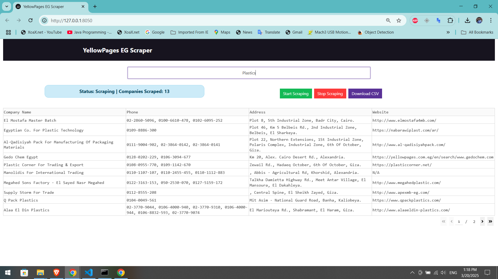

# 📌 YellowPages Egypt Scraper Dash App
A **fully functional Dash web application** that allows users to **scrape business data** from **YellowPages Egypt** dynamically. The app provides a **real-time UI**, displays scraped data in a table, and allows users to **download the data as a CSV file**.

## 🚀 Features
✅ **User-Friendly Interface**:  
- Simple **Dash web UI** with a **modern design**.  
 

✅ **Real-Time Scraping Process**:  
- Scrapes **business names, phone numbers, addresses, and websites**.  
- Displays scraped data **dynamically in a table**.  
- **Status Indicator** updates in real-time to show scraping progress.  

✅ **File Export**:  
- **Download CSV** button to export scraped data instantly.  

✅ **Optimized Scraper**:  
- Uses **Selenium + BeautifulSoup** for reliable data extraction.  
- **Undetected ChromeDriver** to bypass bot detection by mimicking human like behavior.  
- **Ensures all phone numbers are extracted correctly**.  

## 📂 Project Structure
```
📁 YellowPages-Scraper-Dash
│── app.py              # Main entry point for the Dash app
│── layout.py           # Defines UI layout
│── header.py           # Contains the app header
│── scraper.py          # Handles Selenium-based scraping
│── callbacks.py        # Manages interactivity and callbacks
│── requirements.txt    # List of required dependencies
│── README.md           # Project documentation
```

## 🔧 Installation & Setup
### 1️⃣ Install Required Packages
First, **clone the repository** and navigate to the project folder:
```sh
git clone https://github.com/YOUR_GITHUB_USERNAME/YellowPages-Scraper-Dash.git
cd YellowPages-Scraper-Dash
```
Then, install dependencies:
```sh
pip install -r requirements.txt
```

### 2️⃣ Install Selenium WebDriver
Make sure **ChromeDriver** is installed and compatible with your browser version. You can download it from:  
🔗 [ChromeDriver Download](https://sites.google.com/chromium.org/driver/)

### 3️⃣ Run the App
Start the Dash web app:
```sh
python app.py
```
Then, **open your browser** and go to:
```
http://127.0.0.1:8050/
```

## 📝 How to Use
1️⃣ **Enter a keyword** (e.g., "plastic injection") in the input field.  
2️⃣ **Click "Start Scraping"** to begin the scraping process.  
3️⃣ Watch the **real-time table update** with business details.  
4️⃣ **Click "Stop Scraping"** anytime to halt the process.  
5️⃣ **Click "Download CSV"** to save the scraped data.

## 🖼️ Screenshots
| **Main UI** | **Scraping in Progress** |
|------------|--------------------|
|  |  |

## 🛠️ Technologies Used
- **Python 3.x**
- **Dash (Plotly)**
- **Selenium & BeautifulSoup**
- **Undetected ChromeDriver**
- **Pandas**
- **Flask**

## 🤝 Contributing
Want to improve this project?  
- **Fork** the repo  
- **Create a feature branch** (`git checkout -b new-feature`)  
- **Commit your changes** (`git commit -m "Added a cool feature"`)  
- **Push to the branch** (`git push origin new-feature`)  
- **Open a Pull Request** 🎉  

## 📜 License
This project is **open-source** under the **MIT License**.

## 💬 Contact
For any issues or feature requests, feel free to **open an issue** or reach out via:  
📧 Email: **emadsaghier@gmail.com**  
  

### ⭐ If you like this project, consider giving it a star on GitHub! ⭐  

🚀 **Happy Scraping!** 😊
